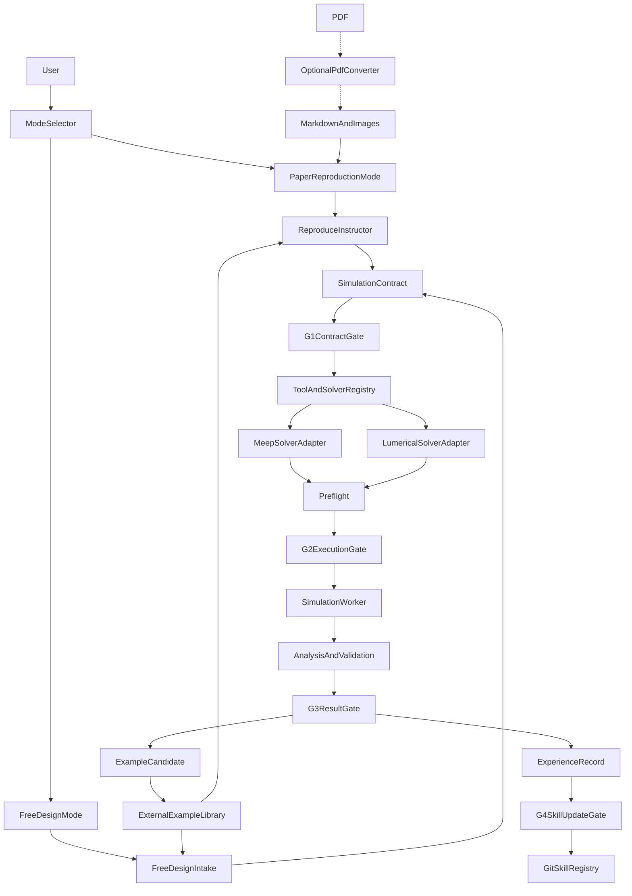

# AI Photonic Design Copilot

本项目是一个面向光子器件论文复现与自由设计的双模式智能仿真框架。

框架以版本化 `SimulationContract` 为中心，通过 Tool Registry 组合多个
Skill，并通过统一 `SolverAdapter` 调用 Meep 或 Ansys Lumerical FDTD。
仿真结果必须经过确定性分析、收敛检查和人工审核，才能进入外置历史
样例库或进一步提炼为 Skill。

详细架构见：

- `Design1.0.md`：长期愿景和原始架构；
- `Design2.0.md`：当前双模式、工具化和多求解器架构；
- `QUALITY_GATES.md`：G1–G4 人工门禁和渐进自动化规则。

## 当前可用范围

目前已经具备：

- 论文复现和自由设计两种需求入口；
- `WorkflowRequest`、`Evidence`、`Targets`、`SimulationContract`、
`RunManifest`、`ValidationReport` 等 V1 Schema；
- Tool Registry 和工具 Manifest；
- Meep 与 Lumerical SolverAdapter；
- 求解器无关的 FDTD 预检、结果字段、收敛和报告规范；
- Lumerical 最小波导、波导弯曲 R/T 和环形谐振器模板；
- 外置 Example Library 的检索、候选暂存和审核发布能力；
- G1–G4 人工审批门禁；
- 双求解器公共波导弯曲 R/T benchmark；
- 不依赖真实求解器的自动化测试。

当前尚未提供统一 GUI、REST API 或“一条命令自动执行到底”的 CLI。
实际使用入口仍是 Cursor Agent 对话中的显式 Skill 调用，或者直接调用
`src/photonic_copilot/` 下的 Python 模块。完整自动状态机是后续封装层，
现有模块已为其提供契约、调用记录、暂停门禁和恢复基础。

## 总体工作流




两种模式只在需求形成阶段不同。一旦产生合法的
`SimulationContract.v1`，后续求解器选择、模型生成、执行、验证、审核
和样例归档全部共用。

## Skill、Tool、SolverAdapter 与 Example 的关系


### Skill

Skill 是供 Agent 阅读的领域工作流和决策规则，主要文件为 `SKILL.md`。

- `reproduce-instructor/SKILL.md`
- `free-design-intake/SKILL.md`
- `meep-fdtd-workflow/SKILL.md`
- `lumerical-fdtd-workflow/SKILL.md`
- `fdtd-core/SKILL.md`
- `UniParser-Paper-Markdown/SKILL.md`

这些 Skill 位于项目目录而不是 `.cursor/skills/`，并且多数设置了
`disable-model-invocation: true`，因此在 Cursor 对话中应使用 `@路径`
显式调用。

### Tool

Tool 是 Orchestrator 可以发现和调用的能力。每个正式工具通过
`tool-manifest.yaml` 声明：

- 工具 ID 和版本；
- capability；
- 输入与输出 Schema；
- 执行入口；
- 超时；
- 是否需要人工批准。

当前 Manifest 包括：

- `reproduce-instructor/tool-manifest.yaml`
- `free-design-intake/tool-manifest.yaml`
- `meep-fdtd-workflow/tool-manifest.yaml`
- `lumerical-fdtd-workflow/tool-manifest.yaml`
- `fdtd-core/tool-manifest.yaml`
- `tools/example-library/tool-manifest.yaml`


### SolverAdapter

`src/photonic_copilot/adapters.py` 定义统一求解器接口：

```text
probe_environment
declare_capabilities
validate_contract
generate_model
preflight
execute
extract_raw
analyze
finalize_validation
propose_convergence_cases
package_artifacts
diagnose
```

现有实现：

- `MeepSolverAdapter`
- `LumericalSolverAdapter`

Adapter 将同一个 `SimulationContract` 映射为求解器脚本、运行参数和公共
结果字段。不能映射的要求必须报告为 `unsupported`、
`requires_assumption` 或 `requires_manual_implementation`，不能静默删除。

### External Example Library

`src/photonic_copilot/example_library.py` 提供：

- `search()`：检索历史案例；
- `get()`：读取指定案例版本；
- `stage_candidate()`：暂存新案例；
- `publish()`：通过 G3 审核后发布不可变版本。

样例库不放在 Git 仓库中。调用者必须指定一个外置目录，例如：

```python
from pathlib import Path
from photonic_copilot.example_library import ExampleLibrary

library = ExampleLibrary(Path(r"D:\PhotonicExampleLibrary"))
```

初始化后目录结构为：

```text
D:\PhotonicExampleLibrary\
├── examples.sqlite3
├── artifacts\
└── staging\
```

目前没有统一配置文件自动指定该目录。未配置 Example Library 时，可以
执行仿真流程，但必须记录“未进行历史案例检索”，不能假装已检索。

## Skill 调用顺序


### 论文复现模式

```text
UniParser-Paper-Markdown（仅当需要 PDF 转换）
→ reproduce-instructor
→ External Example Library（已配置时）
→ G1 Contract Gate
→ meep-fdtd-workflow 或 lumerical-fdtd-workflow
→ fdtd-core validation
→ G3 Result Gate
→ ExampleCandidate
→ External Example Library
```


### 自由设计模式

```text
free-design-intake
→ External Example Library（已配置时）
→ G1 Contract Gate
→ meep-fdtd-workflow 或 lumerical-fdtd-workflow
→ fdtd-core validation
→ G3 Result Gate
→ ExampleCandidate
→ External Example Library
```


### Skill 更新

两种模式都不能直接修改 Skill。人工修正或失败经验应先形成：

```text
ExperienceRecord
→ G4 Skill Update Gate
→ 回归测试
→ 人工合并 Skill 变更
```


## 安装公共运行环境

要求 Python 3.10 或更高版本。

在项目根目录运行：

```text
python -m pip install -e ".[dev]"
python -m pytest
```

该命令只安装求解器无关的平台依赖，不会安装或配置 Meep/Lumerical。

### Meep 环境

Meep 默认要求 Linux 或 WSL2，并在对应 Conda 环境中安装 PyMeep。

在 WSL/Linux 中检查：

```text
python meep-fdtd-workflow/scripts/verify_environment.py
```

不要在原生 Windows Python 中运行 Meep workflow。

### Lumerical 环境

要求：

- 已安装 Ansys Lumerical FDTD；
- 可导入 `ansys.lumerical.core` 或传统 `lumapi`；
- 具有有效 FDTD 许可证。

仅检查 API 导入，不启动许可证会话：

```text
python lumerical-fdtd-workflow/scripts/verify_environment.py
```

只有明确允许消耗许可证席位时才运行：

```text
python lumerical-fdtd-workflow/scripts/verify_environment.py --launch-session
```


## 统一契约与完成状态

权威 Schema 位于：

```text
schemas/v1/contracts.schema.json
```

主要文档：

- `WorkflowRequest`：工作模式和任务入口；
- `PaperManifest`：论文包；
- `Evidence`：参数值、单位、状态和来源；
- `Targets`：论文 figure/panel 目标；
- `SimulationContract`：求解器无关的完整仿真契约；
- `ToolCallRecord`：工具调用审计；
- `RunManifest`：运行环境、版本、命令和工件；
- `ValidationReport`：收敛和物理检查；
- `ExampleCandidate`/`ExampleManifest`：历史案例；
- `ExperienceRecord`：人工修正和规则候选。

全平台只使用三种仿真完成状态：

- `generated`：只生成模型或脚本，未运行真实求解器；
- `executed`：求解器输出可读，但未建立收敛证据；
- `validated`：约定的收敛和物理检查通过。

只运行成功不能标记为 `validated`。

## 人工门禁


### G1 Contract Gate

确认：

- 复现目标或设计目标；
- 材料、偏振、边界和模式；
- 历史案例引用；
- 所有影响物理解释的假设；
- 验收指标和收敛方案。


### G2 Execution Gate

在第一次真实求解器执行前确认：

- 几何、源、monitor、PML 和 mesh 预检；
- 资源和运行时间；
- Lumerical 许可证使用；
- 选择 `base_only` 或 `base_plus_convergence`。

“请生成代码”不等于同意消耗计算资源或许可证。

### G3 Result Gate

确认：

- `ValidationReport`；
- 尚未解决的限制；
- 是否接受复现差异或设计性能；
- 是否允许形成并发布 ExampleCandidate。


### G4 Skill Update Gate

确认：

- ExperienceRecord 是否可泛化；
- Skill diff；
- 回归测试；
- 审核人和回滚版本。


## 论文复现模式：完整运行步骤

本节以“用户应向 Agent 输入什么、Agent 应完成什么、何时必须暂停”为
主线。当前没有统一的一键 CLI，因此建议在同一个 Cursor Agent 会话中
按顺序发送以下指令，并始终引用同一个任务目录。


### 第 0 步：准备任务目录

推荐：

```text
paper-task\
├── paper.md
├── images\
└── paper.pdf              # 可选
```

核心流程从 `paper.md + images/` 开始。PDF 转换不属于核心状态机。

如果只有 PDF，可先在 Cursor Agent 中输入：

```text
@UniParser-Paper-Markdown/SKILL.md

将 @paper-task/paper.pdf 转换为 Markdown 和 images 目录。
不要覆盖已存在的文件；转换完成后校验所有图片链接。
```


### 第 1 步：生成论文证据和仿真契约

在项目根目录打开 Cursor Agent 对话，输入：

```text
@reproduce-instructor/SKILL.md

以论文复现模式处理 @paper-task/。
目标复现 Fig. 2(a)-(c)。
读取论文正文、方法、公式、图注和图片。
生成 instruction.md、evidence.json、targets.json 和
simulation-contract.json。
区分论文明确值、文献值、历史样例建议、假设和未知值。
先不要运行仿真。
```

如果未指定 figure/panel，Agent 应先列出建议目标并等待选择。

预期产物：

```text
paper-task\
├── instruction.md
├── evidence.json
├── targets.json
└── simulation-contract.json
```

Agent 在本步骤必须完成：

1. 检查 Markdown、图片链接和补充材料是否完整；
2. 逐项提取几何、材料、source、boundary、mesh、monitor 和目标数据；
3. 给每个参数分配稳定 `parameter_id`；
4. 标记 `specified`、`literature`、`example_suggestion`、`assumption` 或
   `unknown`；
5. 将每个值关联到页码、章节、公式、表格或图注；
6. 为每个目标 panel 建立 basename、observable 和验收方式；
7. 提出 mesh、PML/padding 和 run-control 收敛案例；
8. 运行 Schema 校验；
9. 输出文件后暂停，不选择求解器、不运行仿真。

如果存在未知参数，Agent 应用问题列表结束本步骤，例如：

```text
当前不能确定以下内容：
1. Si 折射率采用论文常数还是色散模型？
2. Fig.2(b) 的入射偏振未明确，是 TE0 还是 TM0？
3. 论文未给出 PML 距离，是否接受建议值并执行敏感性检查？

请确认后我再完成 G1 契约。
```


### 第 2 步：检索历史案例

如果已经配置 External Example Library，向 Agent 输入：

```text
继续处理 @paper-task/。

External Example Library 根目录为 <EXAMPLE_LIBRARY_ROOT>。
在形成最终 SimulationContract 前检索历史案例：
- 优先相同论文、相邻 figure 和相同器件；
- 再检索相同材料、波段、模式、observable 和求解方法；
- 默认只使用 Validated 或 Reviewed 案例；
- 返回 example ID、版本、质量等级、相似原因、可复用字段和限制；
- 不要用历史样例覆盖论文明确值；
- 将采用的建议写入 evidence.json 和
  SimulationContract.example_references。

检索完成后先展示候选及复用建议，等待我确认。
```

Agent 应按以下范围检索：

- 相同论文或相邻 figure；
- 相同器件和材料；
- 相同波段、模式和 observable；
- 相同求解方法。

检索结果必须记录 example ID、版本、质量等级和复用字段。

案例只能用于模板选择、参数初值、数值设置参考和失败规避。论文已明确的
参数仍以论文证据为准。

未配置样例库时输入：

```text
当前未配置 External Example Library。
请在任务记录中写明“未进行历史案例检索”，然后继续 G1；
不得虚构案例或检索结果。
```

### 第 3 步：执行 G1

要求 Agent 先生成审核摘要，不要直接进入建模：

```text
请对 @paper-task/ 执行 G1 Contract Review。

按以下顺序展示：
1. 目标 figure/panel 与 observable；
2. 论文明确参数及证据位置；
3. 文献补充值和历史样例建议；
4. 所有 unknown 和 assumption；
5. 每个 assumption 的理由与物理后果；
6. 拟采用的求解方法和候选求解器；
7. mesh、PML 和 run-control 收敛计划；
8. 验收指标与阈值；
9. 预期输出工件。

指出所有会改变物理解释的待决问题，然后暂停等待批准。
不要生成模型或启动求解器。
```

人工重点检查：

- `evidence.json` 来源是否正确；
- `targets.json` 是否覆盖目标 panel；
- 未知值和假设是否可接受；
- `simulation-contract.json` 是否符合预期；
- 收敛方案和验收阈值是否合理。

确认后才能选择求解器和生成模型。

批准示例：

```text
批准 G1。
接受 assumption material.si_dispersion，采用论文指定数据表；
接受 assumption pml_distance，但要求将其列入 convergence cases；
目标 panel 和验收阈值保持不变。
可以进入求解器选择和模型生成，但仍不批准真实执行。
```

如果不批准，应明确要求 Agent 返回第 1 或第 2 步修改 JSON 契约，而不是
在求解器脚本中临时覆盖参数。

### 第 4 步：执行仿真

使用 Lumerical：

```text
@lumerical-fdtd-workflow/SKILL.md

读取 @paper-task/instruction.md、@paper-task/evidence.json、
@paper-task/targets.json 和 @paper-task/simulation-contract.json。

使用 Lumerical FDTD：
1. 校验 SimulationContract；
2. 进行不消耗许可证的 API 环境探测；
3. 选择最接近的审核模板并生成参数化 Python/LSF；
4. 保存和检查 .fsp 模型；
5. 完成 geometry/source/monitor/PML/mesh 预检；
6. 在启动真实 FDTD session 前暂停，等待我批准 G2；
7. 执行 smoke、base 和我批准的 convergence cases；
8. 导出原始数据，生成 RunManifest 和 ValidationReport；
9. 完成论文目标对照和差异分析。
```

或者使用 Meep：

```text
@meep-fdtd-workflow/SKILL.md

读取 @paper-task/instruction.md、@paper-task/evidence.json、
@paper-task/targets.json 和 @paper-task/simulation-contract.json。

使用 Meep：
1. 校验 SimulationContract；
2. 在 WSL/Linux 中检查 PyMeep 环境；
3. 选择最接近的模板并生成参数化模型；
4. 完成 geometry/source/monitor/PML/resolution 预检；
5. 在执行真实仿真前暂停，等待我批准 G2；
6. 执行 smoke、base 和我批准的 convergence cases；
7. 导出原始数据，生成 RunManifest 和 ValidationReport；
8. 完成论文目标对照和差异分析。
```

无论选择哪个求解器，Agent 在 G2 前只能完成：

- Contract 与 SolverCapability 匹配；
- 不消耗许可证的环境探测；
- 参数映射；
- 脚本或模型生成；
- 几何和 monitor 布局检查；
- 资源估算；
- 拟执行命令和收敛案例清单。

Agent 应展示：

```text
求解器：
API/版本：
模型和脚本路径：
预计内存/运行时间/许可证：
Smoke Test 配置：
Base Run 配置：
Convergence 配置：
输出目录：
风险与警告：
```

然后以 `WAITING_FOR_EXECUTION_APPROVAL` 状态暂停。此时只完成
`generated`，不能声称已经执行。


### 第 5 步：执行 G2

Agent 必须等待用户明确选择 `base_only` 或
`base_plus_convergence`，并单独确认 Lumerical 许可证。

只运行基础案例：

```text
批准 G2。
选择 base_only。
允许执行 Smoke Test 和 Base Run。
如果使用 Lumerical，允许本次任务占用 1 个 FDTD license seat。
超时上限为 60 分钟；不要执行 convergence 或参数扫描。
```

运行基础案例和收敛验证：

```text
批准 G2。
选择 base_plus_convergence。
允许执行 Smoke Test、Base Run，以及 contract 中已列出的
mesh、PML/padding 和 run-control convergence cases。
如果使用 Lumerical，允许本次任务占用 1 个 FDTD license seat。
每个案例超时 60 分钟；任何 smoke case 异常时立即停止后续任务。
```

收到批准后，Agent 必须按顺序：

1. 记录批准人、选择、资源上限和许可证授权；
2. 执行 Smoke Test；
3. 检查 source/monitor 输出是否有限、非零且物理合理；
4. Smoke Test 失败时停止并返回诊断，不运行 Base Run；
5. 执行 Base Run 并保存原始数据；
6. 只有选择 `base_plus_convergence` 时才执行收敛案例；
7. 无论成功或失败都关闭求解器 session 并保存日志；
8. 更新 `RunManifest`。

选择 `base_only` 时，最高完成状态是 `executed`。

### 第 6 步：结果验证

仿真结束后向 Agent 输入：

```text
继续验证 @paper-task/ 的仿真结果。

读取 simulation-contract.json、evidence.json、targets.json、
RunManifest、全部原始结果和论文目标图片。

按以下顺序执行：
1. 将求解器字段映射为 fdtd-core 公共字段；
2. 检查数组、形状、单位、坐标轴、NaN/Inf 和复数相位；
3. 执行适用的 R/T/A、模式功率、对称性、互易性或解析极限检查；
4. 如果 G2 批准了 convergence，分别比较 mesh、PML 和 run-control；
5. 对 targets.json 中每个 panel 单独进行论文数值或图形对照；
6. 将每项检查的方法、输入、阈值、数值和 pass/fail 写入
   ValidationReport；
7. 明确区分“数值已收敛”和“与论文一致”；
8. 更新 RunManifest 和 completion_state；
9. 生成差异分析，但暂时不要发布 ExampleCandidate。

不要因为求解器正常退出就标记 Validated。
```

Agent 首先调用 `SolverAdapter.extract_raw()`，将 Lumerical/Meep 原始字段
映射为：

```text
frequency
wavelength
reflectance
transmittance
absorption
field_e
field_h
mode_coefficients
q_factor
far_field
```

然后完成四类验证。

第一类是数据有效性：

- 数组非空；
- 不含 NaN 或 Inf；
- 频率/波长轴有效且单调；
- 数据形状、单位和 monitor 名称正确；
- 原始复数场没有被错误地只保留幅值；
- incident power 不接近零。

第二类是物理检查：

- 无损结构 `R + T ≈ 1`；
- 有吸收结构 `R + T + A ≈ 1`；
- 模式功率与总 flux 一致；
- 对称、互易或已知极限成立；
- 共振频率/Q 对运行时间稳定；
- 近远场或模式展开结果自洽。

第三类是收敛检查。每次只改变一类数值参数，并比较目标 observable：

```text
relative_change =
norm(current - previous) / max(norm(current), machine_epsilon)
```

阈值必须来自 `SimulationContract`，不能由 Agent 临时发明。

第四类是逐 panel 论文对照：

- 共振/峰谷位置；
- FWHM、Q、FSR、ER；
- R/T 绝对值或归一化值；
- 场热点、节点、对称性和模式形态；
- 远场主瓣角度和宽度；
- 坐标、单位和允许的旋转/镜像/归一化变换。

论文数字化数据只能作为验证 ground truth，不能替代仿真数据。

Agent 最后应输出类似：

```text
Numerical completion: validated
Paper agreement:
- Fig.2(a): passed
- Fig.2(b): partial, resonance shifted by 4.1 nm
- Fig.2(c): failed, field parity differs

Overall reproduction decision: requires_review
Unresolved limitations:
- paper did not specify sidewall angle
- Fig.2(c) may require a 3D model
```

即使数值已经收敛，也不能把“与论文不一致”隐藏在 Validated 一词中。

### 第 7 步：执行 G3 和案例入库

先要求 Agent 生成 G3 审核包：

```text
请为 @paper-task/ 生成 G3 Result Review 摘要，不要立即入库。

列出：
1. 每个目标 panel 的复现结论；
2. 数值收敛和物理检查；
3. 与论文的差异及可能原因；
4. 所有 assumption、warning 和 limitation；
5. script、native model、raw、derived、plot、log、
   RunManifest 和 ValidationReport 路径；
6. 建议的案例质量等级；
7. 论文许可和敏感性等级；
8. 是否适合作为后续设计初值。

然后暂停等待 G3 决策。
```

人工可选择：

```text
批准 G3，按 Validated 发布。
```

```text
不批准发布；返回模型修正并重新仿真。
```

```text
允许作为失败案例归档，但不得作为默认参数建议。
```

批准发布后再输入：

```text
External Example Library 根目录为 <EXAMPLE_LIBRARY_ROOT>。

根据已批准的 G3 结果：
1. 从 RunManifest 和 ValidationReport 生成 ExampleCandidate；
2. 检查所有工件是否存在；
3. 计算并验证 SHA-256；
4. 检查论文许可、凭据、绝对机器路径和敏感信息；
5. 设置正确质量等级和 failure 标签；
6. 发布新的不可变 ExampleManifest 版本；
7. 返回 example ID、version、quality 和最终工件目录。

不要覆盖已有 example_id@version。
```

质量等级含义：

- `Archived`：资料存在，但未成功执行或不完整；
- `Executed`：运行成功但未执行收敛；
- `Validated`：收敛和适用物理检查通过；
- `Reviewed`：Validated 且经过领域专家审核。

完整数据流为：

```text
RunManifest + ValidationReport
→ ExampleCandidate
→ 完整性/哈希/许可/敏感性检查
→ G3 Approval
→ ExampleManifest
→ External Example Library
```

论文未成功复现但失败原因明确时，可以发布带 failure 标签的
`Archived`/`Executed` 案例，用于后续诊断；不能将其作为默认设计基线。


## 自由设计模式：完整运行步骤


### 第 1 步：提交设计需求

在 Cursor Agent 中输入：

```text
@free-design-intake/SKILL.md

以自由设计模式完成以下需求：
设计一个工作在 1550 nm、TE0 模式的硅环形谐振器。
目标 loaded Q 不低于 10000，消光比不低于 15 dB。
材料采用硅/二氧化硅，工艺最小间隙 150 nm。
优先使用 Lumerical FDTD；如果环境不可用则评估 Meep。
先完成需求澄清、历史案例检索和 SimulationContract，
不要立即运行求解器。
```

需求至少覆盖：

- 器件和物理目标；
- 波长或频率范围；
- 材料和有效模型；
- 几何及工艺约束；
- source、polarization、mode 和 port；
- observable 与接受阈值；
- mesh/PML/run-control 收敛计划；
- 内存、时间和许可证预算；
- 输出工件。

Agent 必须先把自然语言拆成：

```text
硬约束：不可违反，例如最小间隙、材料、波长范围
软目标：需要优化，例如最大化 Q 或最小化损耗
可调参数：有明确上下界
固定参数：不参与优化
验收指标：有单位和阈值
数值要求：mesh、PML、运行时间和收敛案例
资源限制：CPU、内存、总仿真次数、许可证和超时
```

如果信息不足，Agent 应只询问会实质改变物理模型或成本的问题，并在用户
回答前保持 `WAITING_FOR_REQUIREMENT_INPUT`，不能自行发明材料、偏振、
边界条件或准确度目标。

完成后应生成 `simulation-contract.json`，展示候选初始设计及理由，然后
暂停等待历史案例检索和 G1。


### 第 2 步：检索并引用历史案例

向 Agent 输入：

```text
继续处理 @design-task/。
External Example Library 根目录为 <EXAMPLE_LIBRARY_ROOT>。

根据当前 SimulationContract 检索：
- 相同器件类型和拓扑；
- 相同材料、波段、偏振和模式；
- 相同 observable、设计目标和制造约束；
- Meep/Lumerical 中已通过 Validated 或 Reviewed 的案例；
- 相关失败案例及失败原因。

返回每个候选的 example ID、version、quality、相似原因、
可复用字段和限制。先给出复用建议，等待我确认后再写入 contract。
```

案例只能作为：

- 参数初值；
- 模板和求解器参考；
- 网格/PML 设置建议；
- 失败规避经验。

不得覆盖明确用户约束。引用必须写入
`SimulationContract.example_references`。

确认复用后，Agent 必须记录：

```text
example_id/version
复用字段
原始值
新值
变换方式
为什么适用于当前设计
质量等级和限制
```

历史案例中的值在 Evidence 语义上属于 `example_suggestion`，不能伪装成
新的仿真结果。

### 第 3 步：执行 G1

向 Agent 输入：

```text
请对 @design-task/simulation-contract.json 执行 G1 Contract Review。

展示：
1. 设计目标、observable 和验收阈值；
2. 所有硬约束、软目标、固定参数和可调参数范围；
3. 候选初始结构及选择理由；
4. 使用的历史案例和参数变换；
5. 材料、source、mode、boundary、monitor 和单位；
6. 所有 assumption 及物理后果；
7. mesh、PML 和 run-control 收敛案例；
8. 资源预算和最大仿真次数；
9. 候选求解器及 capability 匹配结果。

列出所有待决问题并暂停，不要生成或执行模型。
```

人工确认需求、候选初始设计、历史案例复用、假设和验收指标。

预期核心产物：

```text
simulation-contract.json
```

批准示例：

```text
批准 G1。
保持最小间隙 150 nm 为硬约束；
允许 radius 在 4–8 µm、gap 在 150–300 nm 范围优化；
Q 和 ER 为联合目标，1550 ± 2 nm 为硬约束；
接受列出的材料模型和收敛方案。
可以进入模型生成，但不批准真实求解器执行。
```


### 第 4 步：选择并调用求解器

Lumerical：

```text
@lumerical-fdtd-workflow/SKILL.md

读取 @design-task/simulation-contract.json。
使用 Lumerical FDTD 生成参数化模型，完成环境检查和预检。
启动许可证 session 前等待 G2；执行我批准的 base 和 convergence
案例；导出原始数据并计算 Q、FSR、ER 和约束满足情况。
保存 .fsp、脚本、RunManifest、ValidationReport 和分析文档。
```

Meep：

```text
@meep-fdtd-workflow/SKILL.md

读取 @design-task/simulation-contract.json。
在 WSL/Linux 中使用 Meep 生成参数化模型，完成环境检查和预检。
真实执行前等待 G2；执行我批准的 base 和 convergence 案例；
导出原始数据并计算 Q、FSR、ER 和约束满足情况。
保存脚本、RunManifest、ValidationReport 和分析文档。
```

Agent 在此步骤应：

1. 使用 SolverCapability 检查 dimensionality、material、observable 和
   boundary 是否受支持；
2. 进行不消耗许可证的环境探测；
3. 如果首选求解器不可用，解释原因并提出备选，不得静默切换；
4. 将 contract 参数映射到模板或求解器对象；
5. 生成模型、脚本和预检视图；
6. 估算运行时间、内存、存储和许可证；
7. 列出 Smoke、Base、Convergence 和可选 Optimization 的执行计划；
8. 以 `generated` 状态保存 RunManifest；
9. 暂停等待 G2。

此处的“生成模型”不表示模型已经求解。


### 第 5 步：执行 G2

要求 Agent 输出执行摘要，并确认：

- 使用哪个求解器；
- 是否允许消耗 Lumerical 许可证；
- 资源预算；
- `base_only` 或 `base_plus_convergence`。

仅批准基础验证：

```text
批准 @design-task/ 的 G2。
求解器使用 Lumerical FDTD。
允许占用 1 个 license seat。
选择 base_only，只运行 Smoke Test 和 Base Run。
总运行时间上限 60 分钟，不启动参数优化。
Smoke Test 出现异常时立即停止。
```

批准完整基础收敛：

```text
批准 @design-task/ 的 G2。
求解器使用 Lumerical FDTD。
允许占用 1 个 license seat。
选择 base_plus_convergence，运行 Smoke、Base 和 contract 中定义的
mesh、PML 和 run-control convergence cases。
暂不启动参数优化；基础模型验证后再次等待我的优化批准。
```

自由设计中应将“基础仿真批准”和“优化预算批准”分开。G2 不应被解释为
允许无限参数扫描。


### 第 6 步：仿真、分析和可选优化

基础仿真批准后，向 Agent 输入：

```text
按已批准的 G2 继续 @design-task/。

严格按以下顺序执行：
1. Smoke Test；
2. 检查 source、monitor、场、功率、内存和日志；
3. Smoke 通过后执行 Base Run；
4. 导出原始数据并计算设计指标；
5. 如果选择 base_plus_convergence，分别执行 mesh、PML 和
   run-control convergence；
6. 通过 fdtd-core 检查有限性、坐标轴、能量、模式和收敛；
7. 逐项判断设计目标和制造约束是否满足；
8. 生成基础 ValidationReport；
9. 如果目标已满足，进入最终候选验证；
10. 如果目标未满足，只提出优化计划和预算，暂停等待我批准；
11. 不要自动开始无限参数扫描。
```

### 6.1 Smoke Test

Agent 使用低成本模型检查：

- 模型是否能构建；
- source 是否产生非零场；
- monitor 是否有有限输出；
- PML、边界和模式方向是否合理；
- 内存和运行时间是否超预算；
- Lumerical session 是否能正确关闭。

失败时输出诊断并停止，不进入 Base Run。

### 6.2 Base Run

Base Run 使用 `SimulationContract` 中的初始设计和正式基础数值设置。

Agent 应输出：

```text
初始参数：
求解器和版本：
主要 observable：
性能指标：
硬约束通过情况：
物理检查：
工件路径：
```

例如环形谐振器应至少报告共振波长、loaded Q、FSR、ER、模式分布和功率
平衡。

### 6.3 基础模型收敛

如果 G2 允许，Agent 分别改变：

- mesh accuracy/resolution 或局部网格；
- PML layers/thickness 和结构间距；
- simulation time、decay 或 auto-shutoff。

比较的是 Q、ER、透射谱等目标 observable，而不是模型截图。

未经验证的 Base Run 不能作为优化目标的可靠基线。

### 6.4 判断是否需要优化

Agent 应逐项比较：

```text
目标值
当前值
误差或裕量
pass/fail
是否受收敛问题影响
```

如果目标未达到，Agent 只能先提出优化方案：

```text
请基于已验证的 Base Run 提出优化计划，不要立即执行。

列出：
- 可调参数及上下界；
- 固定参数；
- 目标函数；
- 硬约束；
- 推荐优化方法；
- 粗筛和精筛的数值精度；
- 最大仿真次数、时间和许可证预算；
- 停止条件；
- 最优候选的最终重验证方案。
```

用户随后单独批准优化，例如：

```text
批准优化计划。
允许最多 30 次粗筛和 8 次精筛；
总许可证时间不超过 12 小时；
gap >= 150 nm 为硬约束；
每 10 个候选保存一次 checkpoint；
完成后不要直接接受最优值，必须执行最终收敛验证。
```

### 6.5 优化循环

Agent 执行：

```text
提出候选参数
→ 生成模型
→ 执行真实求解器
→ 提取指标
→ 检查硬约束
→ 记录参数和工件
→ 更新优化器
```

允许粗筛候选使用较低成本设置，但不能使用解析或代理数据冒充真实 FDTD
结果。

### 6.6 最优候选重新验证

优化完成后，向 Agent 输入：

```text
对优化得到的最优候选执行最终重验证：
- 使用正式/更细 mesh；
- 重新检查 PML 和 run-control；
- 检查全部物理与制造约束；
- 必要时执行制造公差扫描；
- 将最终结果与 Base Run 和历史案例比较；
- 生成最终 RunManifest、ValidationReport、优化轨迹和分析文档。

以最终重验证结果为准，不采用优化阶段未经验证的乐观值。
暂时不要发布到 Example Library。
```

完整顺序为：

```text
Smoke Test
→ Base Run
→ Base Convergence
→ Base Validation
→ 可选优化审批
→ 参数扫描/优化
→ 最优候选重新收敛
→ Final ValidationReport
```

### 第 7 步：执行 G3 和案例入库

先向 Agent 输入：

```text
请为 @design-task/ 生成 G3 Result Review 摘要，不要立即入库。

列出：
1. Base Run 与最终候选参数；
2. 每个设计目标的目标值、最终值和 pass/fail；
3. 每个制造及物理硬约束的检查结果；
4. mesh、PML 和 run-control 收敛；
5. 物理检查和未解决 warning；
6. 优化方法、仿真次数、预算使用和停止原因；
7. 最优候选是否完成正式重验证；
8. 使用的历史 example 及参数变换；
9. 全部模型、脚本、raw、derived、plot、log、
   RunManifest 和 ValidationReport；
10. 建议的案例质量等级和可复用范围。

然后暂停等待 G3 决策。
```

人工审核后可选择四种分支。

目标达到且结果可信：

```text
批准 G3。
最终设计达到目标并通过收敛，允许发布为 Validated；
由领域专家确认后可提升为 Reviewed。
```

目标未达到但模型可信：

```text
暂不发布最终设计。
返回优化计划，扩大 radius 范围但保持全部制造硬约束；
提交新的预算后等待批准。
```

数值不可信：

```text
不批准 G3。
返回 convergence 阶段，优先检查 Q 对 mesh 和 simulation time 的稳定性。
```

保存失败经验：

```text
允许作为失败案例归档。
添加 failure 标签和失败原因，不得作为默认设计初值。
```

批准发布后输入：

```text
External Example Library 根目录为 <EXAMPLE_LIBRARY_ROOT>。

创建并发布 ExampleCandidate：
1. 关联最终 RunManifest 和 ValidationReport；
2. 保留父 example ID/version；
3. 记录复用字段、原始值、新值和参数变换；
4. 检查全部工件和 SHA-256；
5. 检查敏感性、许可、凭据和机器专属路径；
6. 按 G3 决策设置 Archived/Executed/Validated/Reviewed；
7. 发布新的不可变 ExampleManifest 版本；
8. 返回 example ID、version、quality、可复用字段和限制。
```

派生关系示例：

```text
derived_from: paper-ring-example@1.0.0

transforms:
- radius: 5.0 µm → 6.2 µm
- gap: 200 nm → 170 nm
- wavelength: 1310 nm → 1550 nm
```

这样后续 Agent 能区分“直接复用”“经过参数变换的派生设计”和“完全独立
设计”，避免把历史参数误认为当前仿真结果。

## Python 模块入口

当前可直接使用以下模块：

```python
from pathlib import Path

from photonic_copilot.adapters import (
    LumericalSolverAdapter,
    MeepSolverAdapter,
)
from photonic_copilot.contracts import ContractValidator
from photonic_copilot.example_library import ExampleLibrary
from photonic_copilot.registry import ToolRegistry
```

发现全部工具：

```python
root = Path.cwd()
registry = ToolRegistry()
tools = registry.discover([root])
```

验证并选择兼容求解器：

```python
import json

contract = json.loads(
    Path("simulation-contract.json").read_text(encoding="utf-8")
)
ContractValidator().validate(contract, "SimulationContract")
compatible = registry.compatible_solvers(contract)
```

SolverAdapter 会生成隔离 Run 目录，但真实 `execute()` 仍要求显式 G2
批准对象。不要绕过审批直接调用商业求解器。

## 公共 benchmark

公共 contract 位于：

```text
benchmarks/waveguide-bend-rt/simulation-contract.json
```

它用于验证：

- Meep 与 Lumerical 接受同一 contract；
- 两侧保留相同 contract hash；
- 输出公共 R/T 字段；
- 独立完成能量和平衡检查；
- 比较谱线趋势而不是强求逐点相同。

默认测试使用合成公共数据，不运行真实求解器：

```text
python -m pytest
```

真实双求解器结果可比较：

```text
python fdtd-core/benchmarks/compare_cross_solver.py \
  <meep-results>/spectra.npz \
  <lumerical-results>/spectra.npz \
  --report cross-solver-report.json
```


## 常见误区

- PDF 转换不是论文复现核心流程，也不应承担物理证据提取。
- `instruction.md` 是人类可读视图，机器执行以 JSON 契约为准。
- Tool Manifest 不等于 Skill；Skill 是知识，Tool 是可调用能力。
- Example Library 不是 Skill Registry；案例与全局规则必须分开。
- 求解器运行成功不代表数值收敛。
- 未执行 convergence 时不能标记 `validated`。
- 论文图像数字化数据只能作为验证参考，不能冒充仿真输出。
- Lumerical API 导入成功不代表许可证 session 已获批准。
- 当前没有统一自动化入口，完整流程需要按上述顺序显式调用 Skill。

